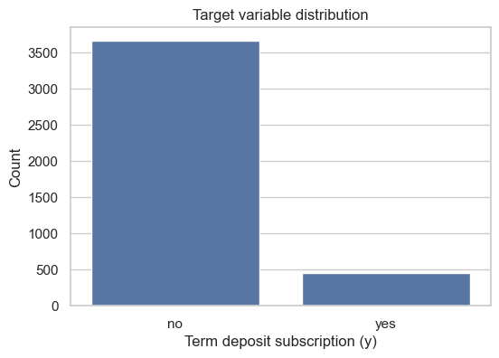

# Bank Marketing: Learning Without Data Leakage

A notebook study of term-deposit subscription prediction, from imbalanced raw data to a carefully ordered logistic-regression pipeline.

**[Open the executed notebook](assignment_1_kiril_petrovski.ipynb)** · [UCI dataset](https://archive.ics.uci.edu/dataset/222/bank+marketing)

Individual Assignment I · Machine Learning Foundations, 2026

**Author:** Kiril Petrovski



Only **451 of 4,119 clients (10.95%)** subscribed. A model that always predicts “no” can look accurate while missing every subscriber. This project focuses on avoiding data leakage and making that tradeoff explicit.

## The workflow

1. Inspect the raw data and identify the subscription target, `y`.
2. Make stratified **60% train / 20% validation / 20% test** splits.
3. Exclude `duration`: call length is not available before the call ends. Keep `unknown` categories explicit and handle the `pdays = 999` sentinel separately.
4. Fit preprocessing and feature selection on training data, then apply the learned transformations to the other splits.
5. Apply **RandomOverSampler only to training data**, preserving real encoded examples instead of interpolating between categories.
6. Train logistic regression, inspect validation performance, then evaluate the held-out test set once.

## Recorded results

| Split | Accuracy | Precision — subscriber | Recall — subscriber |
| --- | ---: | ---: | ---: |
| Validation | 0.8216 | 0.3273 | 0.6000 |
| Test | 0.7949 | 0.2888 | 0.6000 |

The validation majority-class baseline reaches **0.8908 accuracy**, but has zero recall for subscribers. Logistic regression trades overall accuracy for minority-class detection, identifying 60% of subscribers at the recorded decision threshold. Its low precision remains a limitation: these results demonstrate a preprocessing workflow, not a production-ready targeting model.

Metrics and the figure above come from the committed executed notebook; they are not new experimental results.

## Run the notebook

1. Download the **Bank Marketing** archive from [UCI](https://archive.ics.uci.edu/dataset/222/bank+marketing).
2. Extract **`bank-additional.csv`** from `bank-additional.zip` and place it at **`data/raw/bank-additional.csv`**. Use the 4,119-row sample, not `bank-additional-full.csv` or the older `bank.csv`. The raw dataset is not committed here.
3. From the repository root:

```sh
python -m venv .venv
source .venv/bin/activate
python -m pip install -r requirements.txt
jupyter notebook assignment_1_kiril_petrovski.ipynb
```

On Windows, activate with `.venv\Scripts\Activate.ps1` in PowerShell. Restart the kernel and run all cells in order. The notebook uses paths relative to the repository root. Dependencies are currently unpinned; the saved outputs document the submitted run.

## Repository guide

| Path | Contents |
| --- | --- |
| [`assignment_1_kiril_petrovski.ipynb`](assignment_1_kiril_petrovski.ipynb) | Executed analysis, preprocessing decisions, and evaluation |
| [`data/raw/`](data/raw/) | Location for the separately downloaded input CSV |
| [`data/processed/`](data/processed/) | Optional intermediate-data directory |
| [`figures/`](figures/) | Exported notebook visuals |
| [`requirements.txt`](requirements.txt) | Notebook and machine-learning dependencies |

Dataset: Moro, S., Rita, P., and Cortez, P. (2014), [Bank Marketing, UCI Machine Learning Repository](https://doi.org/10.24432/C5K306).

## Academic context

The notebook includes the repository link required by the assignment. Any submitted PDF should be exported from the same executed notebook version committed here.

## AI Use Disclosure

- Most of the project work was done locally before being pushed to GitHub.
- On the last day, AI was used to generate an initial project template structure, which was pushed to GitHub to initialize the repository.
- That initial AI-generated scaffold was later cleaned up manually.
- AI was also used to help draft `README.md`.
